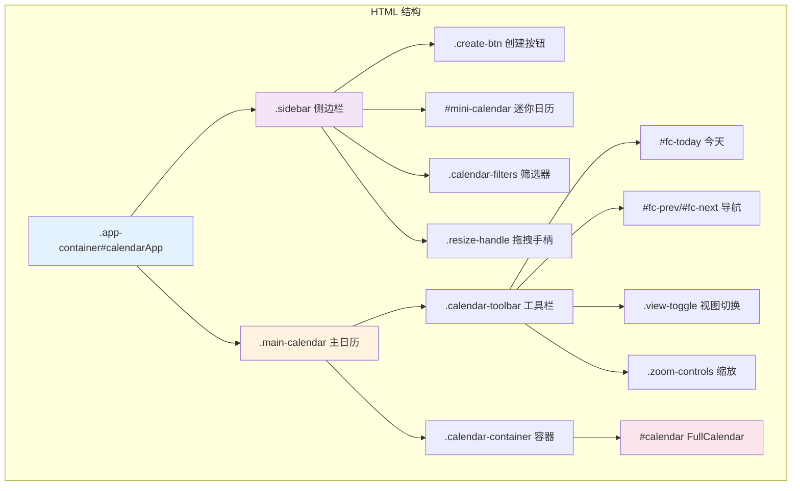
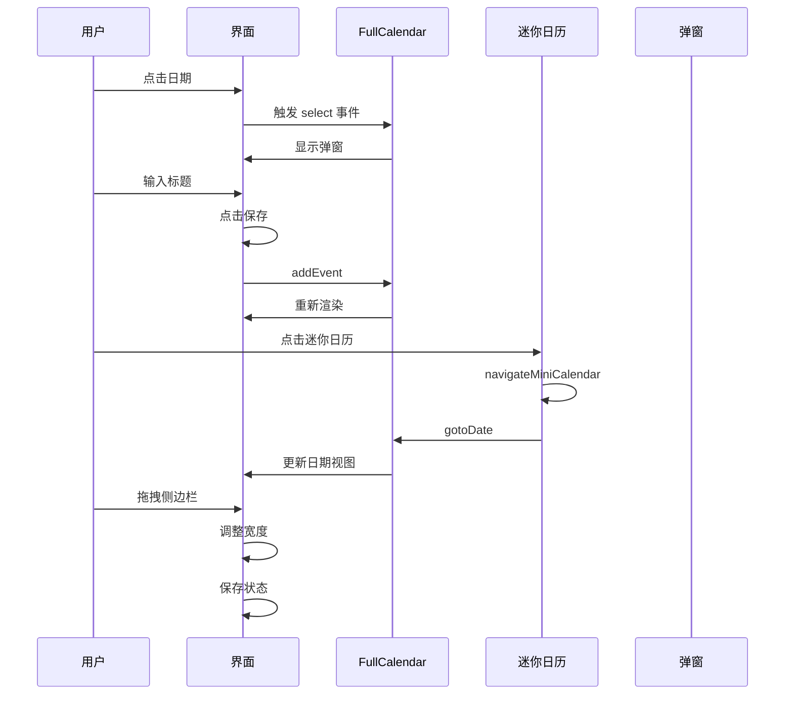
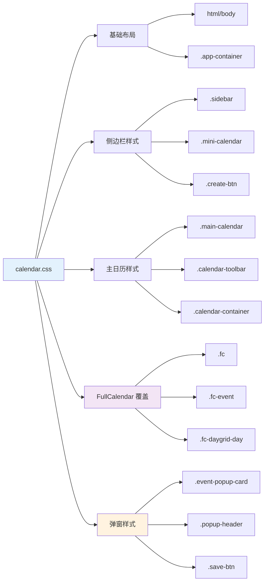

# Electron 日历界面构建指南

本指南将指导你如何在一个空白的 Electron 应用中构建一个现代化的日历界面，包含侧边栏、主日历视图、迷你日历和工具栏。

---

## 📋 目录

1. [项目结构](#项目结构)
2. [HTML 布局](#html-布局)
3. [CSS 样式](#css-样式)
4. [JavaScript 逻辑](#javascript-逻辑)
5. [FullCalendar 集成](#fullcalendar-集成)
6. [架构图](#架构图)

---

## 1. 项目结构

```
your-electron-app/
├── src/
│   └── renderer/
│       ├── index.html          # 主页面
│       ├── css/
│       │   └── components/
│       │       └── calendar.css  # 日历样式
│       └── js/
│           └── core/
│               └── calendar.js   # 日历逻辑
├── package.json
└── ...
```

---

## 2. HTML 布局

在 `src/renderer/index.html` 中添加以下结构：

```html
<!DOCTYPE html>
<html lang="zh-CN">
<head>
  <meta charset="UTF-8">
  <meta name="viewport" content="width=device-width, initial-scale=1.0">
  <title>Skippy Calendar</title>
  
  <!-- FullCalendar CDN -->
  <script src="https://cdn.jsdelivr.net/npm/fullcalendar@6.1.10/index.global.min.js"></script>
  
  <!-- 样式文件 -->
  <link rel="stylesheet" href="css/components/calendar.css">
</head>
<body>
  <!-- 主应用容器 -->
  <div class="app-container" id="calendarApp">
    
    <!-- 左侧边栏 -->
    <div class="sidebar" id="sidebar">
      <!-- 创建按钮 -->
      <div class="sidebar-header">
        <button class="create-btn" id="fc-create-btn">+ 创建日程</button>
      </div>
      
      <!-- 迷你日历 -->
      <div class="mini-calendar-wrapper">
        <div id="mini-calendar"></div>
      </div>
      
      <!-- 日历筛选 -->
      <div class="calendar-filters">
        <h3>我的日历</h3>
        <div class="filter-item">
          <input type="checkbox" id="filter-course" checked>
          <label for="filter-course">课程</label>
        </div>
        <div class="filter-item">
          <input type="checkbox" id="filter-task" checked>
          <label for="filter-task">任务</label>
        </div>
      </div>
      
      <!-- 侧边栏拖拽手柄 -->
      <div class="sidebar-resize-handle" id="sidebar-resize-handle"></div>
    </div>
    
    <!-- 右侧主日历 -->
    <div class="main-calendar">
      <!-- 工具栏 -->
      <div class="calendar-toolbar">
        <button id="fc-today">今天</button>
        <button id="fc-prev">‹ 上月</button>
        <button id="fc-next">下月 ›</button>
        <h2 id="current-period"></h2>
        <div class="view-toggle">
          <button class="view-btn active" data-view="month">月</button>
          <button class="view-btn" data-view="week">周</button>
        </div>
        <div class="zoom-controls">
          <button id="zoom-out">−</button>
          <span id="zoom-level">100%</span>
          <button id="zoom-in">+</button>
        </div>
      </div>
      
      <!-- 日历容器 -->
      <div class="calendar-container">
        <div id="calendar"></div>
      </div>
    </div>
  </div>
  
  <!-- 日程创建弹窗 -->
  <div id="event-popup-card" class="event-popup-card" style="display: none;">
    <div class="popup-header">
      <span class="close-btn" id="popup-close">✕</span>
    </div>
    <div class="popup-body">
      <input 
        type="text" 
        id="popup-event-title"
        placeholder="添加课程或任务名称..." 
        autocomplete="off"
      />
      <div class="time-display" id="popup-time-display"></div>
    </div>
    <div class="popup-footer">
      <button class="save-btn" id="popup-save">保存</button>
    </div>
  </div>
  
  <!-- JavaScript 文件 -->
  <script src="js/core/calendar.js"></script>
</body>
</html>
```

---

## 3. CSS 样式

创建 `src/renderer/css/components/calendar.css`：

```css
/* ========================================
   基础布局
   ======================================== */

html, body {
  height: 100%;
  overflow: hidden;
  margin: 0;
  padding: 0;
  font-family: -apple-system, BlinkMacSystemFont, "Segoe UI", Roboto, sans-serif;
}

.app-container {
  display: flex;
  height: 100vh;
  width: 100%;
  background-color: #f8f9fa;
  overflow: hidden;
}

/* ========================================
   侧边栏样式
   ======================================== */

.sidebar {
  width: 260px;
  min-width: 200px;
  max-width: 400px;
  background-color: #ffffff;
  border-right: 1px solid #e0e0e0;
  display: flex;
  flex-direction: column;
  padding: 16px 0;
  z-index: 10;
  overflow-y: auto;
  position: relative;
}

.sidebar-header {
  padding: 0 16px 16px;
}

.create-btn {
  width: 100%;
  padding: 12px;
  background-color: #1a73e8;
  color: white;
  border: none;
  border-radius: 8px;
  font-size: 14px;
  font-weight: 600;
  cursor: pointer;
  transition: background-color 0.2s;
}

.create-btn:hover {
  background-color: #1557b0;
}

/* 迷你日历 */
.mini-calendar-wrapper {
  padding: 0 16px;
  margin-bottom: 16px;
}

.mini-calendar {
  font-family: -apple-system, BlinkMacSystemFont, "Segoe UI", Roboto, sans-serif;
}

.mini-calendar-header {
  display: flex;
  justify-content: space-between;
  align-items: center;
  padding: 8px 0;
  margin-bottom: 8px;
}

.mini-calendar-title {
  font-size: 14px;
  font-weight: 600;
  color: #3c4043;
}

.mini-calendar-prev,
.mini-calendar-next {
  background: none;
  border: none;
  font-size: 18px;
  color: #5f6368;
  cursor: pointer;
  padding: 4px 8px;
  border-radius: 4px;
}

.mini-calendar-prev:hover,
.mini-calendar-next:hover {
  background-color: #f1f3f4;
}

.mini-calendar-weekdays {
  display: grid;
  grid-template-columns: repeat(7, 1fr);
  text-align: center;
  margin-bottom: 4px;
}

.mini-calendar-weekdays span {
  font-size: 11px;
  color: #5f6368;
  font-weight: 500;
}

.mini-calendar-days {
  display: grid;
  grid-template-columns: repeat(7, 1fr);
  text-align: center;
}

.mini-calendar-day {
  font-size: 12px;
  color: #3c4043;
  padding: 4px;
  cursor: pointer;
  border-radius: 50%;
  transition: background-color 0.15s, color 0.15s;
}

.mini-calendar-day:hover:not(.empty) {
  background-color: #f1f3f4;
}

.mini-calendar-day.empty {
  cursor: default;
}

.mini-calendar-day.today {
  background-color: #e8f0fe;
  color: #1a73e8;
  font-weight: 600;
}

.mini-calendar-day.selected {
  background-color: #1a73e8;
  color: white;
}

/* 日历筛选 */
.calendar-filters {
  padding: 0 16px;
}

.calendar-filters h3 {
  font-size: 14px;
  font-weight: 600;
  color: #3c4043;
  margin-bottom: 12px;
}

.filter-item {
  display: flex;
  align-items: center;
  margin-bottom: 8px;
}

.filter-item input[type="checkbox"] {
  margin-right: 8px;
}

.filter-item label {
  font-size: 13px;
  color: #5f6368;
  cursor: pointer;
}

/* 侧边栏拖拽手柄 */
.sidebar-resize-handle {
  position: absolute;
  right: 0;
  top: 0;
  bottom: 0;
  width: 5px;
  cursor: col-resize;
  z-index: 20;
}

.sidebar-resize-handle:hover {
  background-color: rgba(26, 115, 232, 0.3);
}

/* ========================================
   主日历样式
   ======================================== */

.main-calendar {
  flex: 1;
  padding: 0;
  position: relative;
  background-color: #ffffff;
  overflow: hidden;
  display: flex;
  flex-direction: column;
  height: 100%;
}

/* 工具栏 */
.calendar-toolbar {
  flex-shrink: 0;
  padding: 16px 24px;
  display: flex;
  align-items: center;
  gap: 16px;
  border-bottom: 1px solid #e0e0e0;
}

.calendar-toolbar button {
  background: #ffffff;
  border: 1px solid #dadce0;
  border-radius: 0;
  padding: 6px 12px;
  font-size: 14px;
  color: #3c4043;
  cursor: pointer;
  transition: all 0.2s;
}

.calendar-toolbar button:hover {
  background: #f8f9fa;
}

.calendar-toolbar button.active {
  background: #e8f0fe;
  border-color: #1a73e8;
  color: #1a73e8;
}

#current-period {
  margin: 0 auto;
  font-size: 20px;
  font-weight: 600;
  color: #3c4043;
}

.view-toggle {
  display: flex;
  gap: 0;
  border: 1px solid #dadce0;
  border-radius: 0;
  overflow: hidden;
}

.view-toggle button {
  border-radius: 0;
  border-left: none;
  border-right: 1px solid #dadce0;
}

.view-toggle button:first-child {
  border-left: none;
}

.view-toggle button:last-child {
  border-right: none;
}

.zoom-controls {
  display: flex;
  align-items: center;
  gap: 8px;
  margin-left: 16px;
}

.zoom-controls button {
  width: 28px;
  height: 28px;
  padding: 0;
  font-size: 18px;
  line-height: 1;
  display: flex;
  align-items: center;
  justify-content: center;
}

#zoom-level {
  font-size: 13px;
  color: #5f6368;
  min-width: 40px;
  text-align: center;
}

/* 日历容器 */
.calendar-container {
  flex: 1;
  overflow: hidden;
  padding: 0;
  width: 100%;
  min-height: 0;
}

#calendar {
  height: 100%;
  width: 100%;
}

/* ========================================
   FullCalendar 样式覆盖
   ======================================== */

.fc {
  height: 100% !important;
  width: 100% !important;
  border: none !important;
  font-size: 14px !important;
}

.fc * {
  box-sizing: border-box !important;
}

.fc-view {
  overflow: hidden !important;
}

.fc .fc-view-harness {
  overflow: auto !important;
}

.fc-dayGridMonth-view .fc-view-harness {
  overflow: visible !important;
}

.fc-timeGridWeek-view .fc-view-harness {
  overflow-x: auto !important;
  overflow-y: scroll !important;
}

.fc .fc-daygrid-day {
  cursor: pointer;
  min-height: 80px;
}

.fc-dayGridMonth-view .fc-daygrid-day {
  min-height: 100px;
}

.fc .fc-timegrid-slot {
  height: 48px;
}

.fc .fc-day-today {
  background-color: #e8f0fe !important;
}

.fc .fc-col-header-cell-cushion {
  color: #5f6368;
  font-weight: 600;
  padding: 8px 0;
}

.fc .fc-timegrid-slot-label-cushion {
  color: #5f6368;
  font-size: 12px;
}

/* 事件样式 */
.fc .fc-event {
  border-radius: 6px;
  padding: 3px 6px;
  font-size: 12px;
  font-weight: 500;
  cursor: pointer;
  transition: transform 0.2s ease, box-shadow 0.2s ease;
  border: none;
}

.fc .fc-event:hover {
  transform: translateY(-2px);
  box-shadow: 0 4px 8px rgba(26, 115, 232, 0.2);
  z-index: 5;
}

.fc-h-event {
  background: linear-gradient(135deg, #1a73e8 0%, #4791ff 100%);
}

.fc-v-event {
  background: rgba(26, 115, 232, 0.1);
  border-left: 4px solid #1a73e8;
  color: #1a73e8;
}

.fc-v-event .fc-event-main {
  color: #1a73e8;
}

/* ========================================
   弹窗样式
   ======================================== */

.event-popup-card {
  position: absolute;
  width: 300px;
  background: white;
  border-radius: 12px;
  box-shadow: 0 8px 32px rgba(0, 0, 0, 0.12);
  border: 1px solid #e0e0e0;
  z-index: 10000;
  animation: popIn 0.2s ease-out;
}

@keyframes popIn {
  from {
    opacity: 0;
    transform: scale(0.9);
  }
  to {
    opacity: 1;
    transform: scale(1);
  }
}

.popup-header {
  display: flex;
  justify-content: flex-end;
  padding: 12px 16px;
  border-bottom: 1px solid #f0f0f0;
}

.close-btn {
  font-size: 20px;
  color: #5f6368;
  cursor: pointer;
  padding: 4px 8px;
  border-radius: 4px;
  transition: background-color 0.2s;
}

.close-btn:hover {
  background-color: #f1f3f4;
}

.popup-body {
  padding: 16px;
}

#popup-event-title {
  width: 100%;
  padding: 12px;
  border: 1px solid #dadce0;
  border-radius: 8px;
  font-size: 14px;
  margin-bottom: 12px;
  outline: none;
}

#popup-event-title:focus {
  border-color: #1a73e8;
  box-shadow: 0 0 0 2px rgba(26, 115, 232, 0.1);
}

.time-display {
  font-size: 13px;
  color: #5f6368;
}

.popup-footer {
  padding: 12px 16px;
  border-top: 1px solid #f0f0f0;
  display: flex;
  justify-content: flex-end;
}

.save-btn {
  padding: 8px 24px;
  background-color: #1a73e8;
  color: white;
  border: none;
  border-radius: 8px;
  font-size: 14px;
  font-weight: 600;
  cursor: pointer;
  transition: background-color 0.2s;
}

.save-btn:hover {
  background-color: #1557b0;
}
```

---

## 4. JavaScript 逻辑

创建 `src/renderer/js/core/calendar.js`：

```javascript
(function() {
  'use strict';

  let currentDate = new Date();
  let currentView = 'month';
  let calendarInstance = null;
  let showPopup = false;
  let popupPos = { x: 0, y: 0 };
  let draftEvent = null;
  let eventTitle = '';
  let currentZoom = 100;

  // 初始化日历
  function initCalendar() {
    const calendarEl = document.getElementById('calendar');
    if (!calendarEl || typeof FullCalendar === 'undefined') {
      console.warn('[Calendar] FullCalendar not available');
      return;
    }

    const events = []; // 可以添加事件数据

    calendarInstance = new FullCalendar.Calendar(calendarEl, {
      initialView: 'dayGridMonth',
      locale: 'zh-cn',
      headerToolbar: false,
      buttonText: {
        today: '今天',
        month: '月',
        week: '周',
        day: '日'
      },
      editable: true,
      selectable: true,
      selectMirror: true,
      dayMaxEvents: true,
      slotMinTime: '06:00:00',
      slotMaxTime: '23:00:00',
      allDaySlot: false,
      events: events,
      select: handleDateSelect,
      unselect: handleUnselect,
      eventClick: handleEventClick,
      eventDrop: handleEventDrop,
      eventResize: handleEventResize,
      datesSet: handleDatesSet,
      height: '100%'
    });

    calendarInstance.render();

    initMiniCalendar();
    setupCalendarToolbar();
    setupSidebarResize();
  }

  // 初始化迷你日历
  function initMiniCalendar() {
    const miniCalendarEl = document.getElementById('mini-calendar');
    if (!miniCalendarEl) return;

    renderMiniCalendar(new Date());
  }

  // 渲染迷你日历
  function renderMiniCalendar(date) {
    const miniCalendarEl = document.getElementById('mini-calendar');
    if (!miniCalendarEl) return;

    const year = date.getFullYear();
    const month = date.getMonth();
    
    const monthNames = ['1 月', '2 月', '3 月', '4 月', '5 月', '6 月', '7 月', '8 月', '9 月', '10 月', '11 月', '12 月'];
    const weekDays = ['日', '一', '二', '三', '四', '五', '六'];
    
    const firstDay = new Date(year, month, 1);
    const lastDay = new Date(year, month + 1, 0);
    const startDay = firstDay.getDay();
    const totalDays = lastDay.getDate();
    
    const today = new Date();
    today.setHours(0, 0, 0, 0);

    let html = `
      <div class="mini-calendar">
        <div class="mini-calendar-header">
          <button class="mini-calendar-prev" onclick="window.Calendar.navigateMiniCalendar(-1)">‹</button>
          <span class="mini-calendar-title">${year}年 ${monthNames[month]}</span>
          <button class="mini-calendar-next" onclick="window.Calendar.navigateMiniCalendar(1)">›</button>
        </div>
        <div class="mini-calendar-weekdays">
          ${weekDays.map(d => `<span>${d}</span>`).join('')}
        </div>
        <div class="mini-calendar-days">
    `;

    for (let i = 0; i < startDay; i++) {
      html += '<span class="mini-calendar-day empty"></span>';
    }

    for (let day = 1; day <= totalDays; day++) {
      const currentDate = new Date(year, month, day);
      currentDate.setHours(0, 0, 0, 0);
      
      let classes = 'mini-calendar-day';
      if (currentDate.getTime() === today.getTime()) {
        classes += ' today';
      }
      
      html += `<span class="${classes}" data-date="${year}-${month + 1}-${day}" onclick="window.Calendar.selectMiniCalendarDate('${year}-${month + 1}-${day}')">${day}</span>`;
    }

    html += `
        </div>
      </div>
    `;

    miniCalendarEl.innerHTML = html;
  }

  // 导航迷你日历
  function navigateMiniCalendar(delta) {
    const date = new Date(currentDate);
    date.setMonth(date.getMonth() + delta);
    currentDate = date;
    renderMiniCalendar(date);
    if (calendarInstance) {
      calendarInstance.gotoDate(date);
    }
  }

  // 选择迷你日历日期
  function selectMiniCalendarDate(dateStr) {
    const date = new Date(dateStr);
    currentDate = date;
    if (calendarInstance) {
      calendarInstance.gotoDate(date);
    }
    renderMiniCalendar(date);
  }

  // 处理日期选择
  function handleDateSelect(selectInfo) {
    const mouseX = selectInfo.jsEvent.clientX;
    const mouseY = selectInfo.jsEvent.clientY;

    const popupWidth = 300;
    const popupHeight = 180;
    const finalX = mouseX + popupWidth > window.innerWidth ? window.innerWidth - popupWidth - 20 : mouseX;
    const finalY = mouseY + popupHeight > window.innerHeight ? window.innerHeight - popupHeight - 20 : mouseY;

    popupPos = { x: finalX, y: finalY };
    draftEvent = selectInfo;
    eventTitle = '';
    showPopup = true;
    
    renderPopup();
  }

  // 取消选择
  function handleUnselect() {
    showPopup = false;
    removePopup();
  }

  // 处理事件点击
  function handleEventClick(clickInfo) {
    const newTitle = prompt('修改日程标题:', clickInfo.event.title);
    if (newTitle) {
      clickInfo.event.setProp('title', newTitle);
    }
  }

  // 处理事件拖拽
  function handleEventDrop(dropInfo) {
    console.log('[Calendar] Event dropped:', dropInfo.event.title);
  }

  // 处理事件调整大小
  function handleEventResize(resizeInfo) {
    console.log('[Calendar] Event resized:', resizeInfo.event.title);
  }

  // 处理日期变化
  function handleDatesSet(dateInfo) {
    currentDate = dateInfo.view.currentStart;
    currentView = dateInfo.view.type === 'timeGridWeek' ? 'week' : 'month';
    
    if (document.getElementById('mini-calendar')) {
      renderMiniCalendar(currentDate);
    }
    
    updatePeriodDisplay();
  }

  // 更新周期显示
  function updatePeriodDisplay() {
    const currentPeriodEl = document.getElementById('current-period');
    if (!currentPeriodEl) return;

    const monthNames = ['一月', '二月', '三月', '四月', '五月', '六月', '七月', '八月', '九月', '十月', '十一月', '十二月'];
    
    if (currentView === 'week') {
      const weekStart = new Date(currentDate);
      weekStart.setDate(currentDate.getDate() - currentDate.getDay());
      const weekEnd = new Date(weekStart);
      weekEnd.setDate(weekStart.getDate() + 6);
      currentPeriodEl.textContent = `${weekStart.getMonth() + 1}月 ${weekStart.getDate()}日 - ${weekEnd.getMonth() + 1}月 ${weekEnd.getDate()}日`;
    } else {
      currentPeriodEl.textContent = `${currentDate.getFullYear()}年 ${monthNames[currentDate.getMonth()]}`;
    }
  }

  // 渲染弹窗
  function renderPopup() {
    removePopup();

    if (!showPopup || !draftEvent) return;

    const popup = document.createElement('div');
    popup.id = 'event-popup-card';
    popup.className = 'event-popup-card';
    popup.style.position = 'absolute';
    popup.style.left = `${popupPos.x}px`;
    popup.style.top = `${popupPos.y}px`;

    const startDate = draftEvent.startStr ? new Date(draftEvent.startStr) : null;
    const endDate = draftEvent.endStr ? new Date(draftEvent.endStr) : null;
    
    const formatTime = (date) => {
      if (!date) return '';
      return date.toLocaleTimeString([], { hour: '2-digit', minute: '2-digit' });
    };

    popup.innerHTML = `
      <div class="popup-header">
        <span class="close-btn" id="popup-close">✕</span>
      </div>
      <div class="popup-body">
        <input 
          type="text" 
          id="popup-event-title"
          placeholder="添加课程或任务名称..." 
          value="${eventTitle}"
          autocomplete="off"
        />
        <div class="time-display">
          ${formatTime(startDate)} - ${formatTime(endDate)}
        </div>
      </div>
      <div class="popup-footer">
        <button class="save-btn" id="popup-save">保存</button>
      </div>
    `;

    document.body.appendChild(popup);

    document.getElementById('popup-close').addEventListener('click', closePopup);
    document.getElementById('popup-save').addEventListener('click', savePopupEvent);
    
    const input = document.getElementById('popup-event-title');
    input.addEventListener('keydown', (e) => {
      if (e.key === 'Enter') savePopupEvent();
      if (e.key === 'Escape') closePopup();
    });
    
    setTimeout(() => input.focus(), 100);
  }

  // 移除弹窗
  function removePopup() {
    const existing = document.getElementById('event-popup-card');
    if (existing) {
      existing.remove();
    }
  }

  // 关闭弹窗
  function closePopup() {
    showPopup = false;
    if (draftEvent && calendarInstance) {
      calendarInstance.unselect();
    }
    removePopup();
  }

  // 保存弹窗事件
  function savePopupEvent() {
    const input = document.getElementById('popup-event-title');
    if (!input || !input.value.trim() || !draftEvent) {
      closePopup();
      return;
    }

    const newEvent = {
      id: `skippy_${Date.now()}`,
      title: input.value.trim(),
      start: draftEvent.startStr,
      end: draftEvent.endStr,
      allDay: draftEvent.allDay || false,
      backgroundColor: '#4285F4',
      borderColor: '#4285F4'
    };

    if (calendarInstance) {
      calendarInstance.addEvent(newEvent);
    }

    closePopup();
  }

  // 设置工具栏
  function setupCalendarToolbar() {
    const todayBtn = document.getElementById('fc-today');
    const prevBtn = document.getElementById('fc-prev');
    const nextBtn = document.getElementById('fc-next');
    const periodEl = document.getElementById('current-period');
    const viewBtns = document.querySelectorAll('.view-btn');
    const zoomInBtn = document.getElementById('zoom-in');
    const zoomOutBtn = document.getElementById('zoom-out');
    const zoomLevelEl = document.getElementById('zoom-level');

    if (!todayBtn || !prevBtn || !nextBtn || !periodEl) return;

    todayBtn.onclick = function() {
      if (calendarInstance) {
        calendarInstance.today();
      }
    };

    prevBtn.onclick = function() {
      if (calendarInstance) {
        calendarInstance.prev();
      }
    };

    nextBtn.onclick = function() {
      if (calendarInstance) {
        calendarInstance.next();
      }
    };

    viewBtns.forEach(btn => {
      btn.onclick = function() {
        if (!calendarInstance) return;
        
        viewBtns.forEach(b => b.classList.remove('active'));
        btn.classList.add('active');
        
        const view = btn.dataset.view;
        if (view === 'month') {
          calendarInstance.changeView('dayGridMonth');
          prevBtn.textContent = '‹ 上月';
          nextBtn.textContent = '下月 ›';
        } else if (view === 'week') {
          calendarInstance.changeView('timeGridWeek');
          prevBtn.textContent = '‹ 上周';
          nextBtn.textContent = '下周 ›';
        }
      };
    });

    if (zoomInBtn && zoomOutBtn && zoomLevelEl) {
      zoomInBtn.onclick = function() {
        if (currentZoom < 200) {
          currentZoom += 10;
          applyZoom();
        }
      };

      zoomOutBtn.onclick = function() {
        if (currentZoom > 50) {
          currentZoom -= 10;
          applyZoom();
        }
      };

      function applyZoom() {
        const calendarApp = document.getElementById('calendarApp');
        if (calendarApp) {
          calendarApp.style.transform = `scale(${currentZoom / 100})`;
          const scale = currentZoom / 100;
          calendarApp.style.height = `${100 / scale}%`;
        }
        zoomLevelEl.textContent = currentZoom + '%';
      }
    }
  }

  // 设置侧边栏调整大小
  function setupSidebarResize() {
    const sidebar = document.getElementById('sidebar');
    const resizeHandle = document.getElementById('sidebar-resize-handle');
    
    if (!sidebar || !resizeHandle) return;

    let isResizing = false;
    let startX = 0;
    let startWidth = 0;

    resizeHandle.addEventListener('mousedown', function(e) {
      isResizing = true;
      startX = e.clientX;
      startWidth = sidebar.offsetWidth;
      document.body.style.cursor = 'col-resize';
      document.body.style.userSelect = 'none';
    });

    document.addEventListener('mousemove', function(e) {
      if (!isResizing) return;
      
      const diff = e.clientX - startX;
      const newWidth = startWidth + diff;
      
      if (newWidth >= 200 && newWidth <= 400) {
        sidebar.style.width = newWidth + 'px';
      }
    });

    document.addEventListener('mouseup', function() {
      if (isResizing) {
        isResizing = false;
        document.body.style.cursor = '';
        document.body.style.userSelect = '';
      }
    });
  }

  // 导出公共 API
  window.Calendar = {
    init: initCalendar,
    navigateMiniCalendar: navigateMiniCalendar,
    selectMiniCalendarDate: selectMiniCalendarDate
  };

  // 页面加载完成后初始化
  if (document.readyState === 'loading') {
    document.addEventListener('DOMContentLoaded', initCalendar);
  } else {
    initCalendar();
  }
})();
```

---

## 5. FullCalendar 集成

### 安装方式（可选）

如果使用 npm 安装：

```bash
npm install @fullcalendar/core @fullcalendar/daygrid @fullcalendar/timegrid @fullcalendar/interaction
```

然后在 JS 中引入：

```javascript
import { Calendar } from '@fullcalendar/core';
import dayGridPlugin from '@fullcalendar/daygrid';
import timeGridPlugin from '@fullcalendar/timegrid';
import interactionPlugin from '@fullcalendar/interaction';
```

### CDN 方式（推荐）

在 HTML 中添加：

```html
<script src="https://cdn.jsdelivr.net/npm/fullcalendar@6.1.10/index.global.min.js"></script>
```

---

## 6. 架构图

### 整体布局架构



### 数据流架构



### CSS 层级结构



---

## 7. 快速开始

### 步骤 1：创建基础 Electron 项目

```bash
mkdir my-calendar-app
cd my-calendar-app
npm init -y
npm install electron --save-dev
```

### 步骤 2：创建文件结构

按照上面的目录结构创建文件。

### 步骤 3：配置 package.json

```json
{
  "name": "my-calendar-app",
  "version": "1.0.0",
  "main": "main.js",
  "scripts": {
    "start": "electron ."
  }
}
```

### 步骤 4：创建 Electron 主进程

创建 `main.js`：

```javascript
const { app, BrowserWindow } = require('electron');

function createWindow() {
  const win = new BrowserWindow({
    width: 1200,
    height: 800,
    webPreferences: {
      nodeIntegration: true,
      contextIsolation: false
    }
  });

  win.loadFile('src/renderer/index.html');
}

app.whenReady().then(createWindow);
```

### 步骤 5：运行

```bash
npm start
```

---

## 8. 功能清单

✅ **已实现功能**
- [x] 侧边栏布局
- [x] 迷你日历（月视图）
- [x] 主日历（月/周视图）
- [x] 工具栏（导航、视图切换、缩放）
- [x] 侧边栏宽度调整
- [x] 日期选择弹窗
- [x] 事件创建和编辑
- [x] 事件拖拽和调整大小
- [x] 迷你日历与主日历同步

❌ **未实现功能**
- [ ] 日视图
- [ ] 数据库持久化
- [ ] 云端同步
- [ ] 悬浮球
- [ ] 通知提醒

---

## 9. 常见问题

### Q: 如何添加自定义事件数据？

在 `initCalendar()` 函数的 `events` 数组中添加：

```javascript
const events = [
  {
    id: '1',
    title: '课程 1',
    start: '2024-03-15T10:00:00',
    end: '2024-03-15T11:00:00',
    backgroundColor: '#1a73e8'
  }
];
```

### Q: 如何修改配色方案？

在 CSS 文件中搜索颜色值（如 `#1a73e8`）并替换为你喜欢的颜色。

### Q: 如何添加更多视图？

在工具栏中添加按钮，并在 JS 中添加对应的 `changeView()` 调用：

```javascript
// HTML
<button class="view-btn" data-view="day">日</button>

// JS
else if (view === 'day') {
  calendarInstance.changeView('timeGridDay');
}
```

---

**祝你构建顺利！** 🎉
