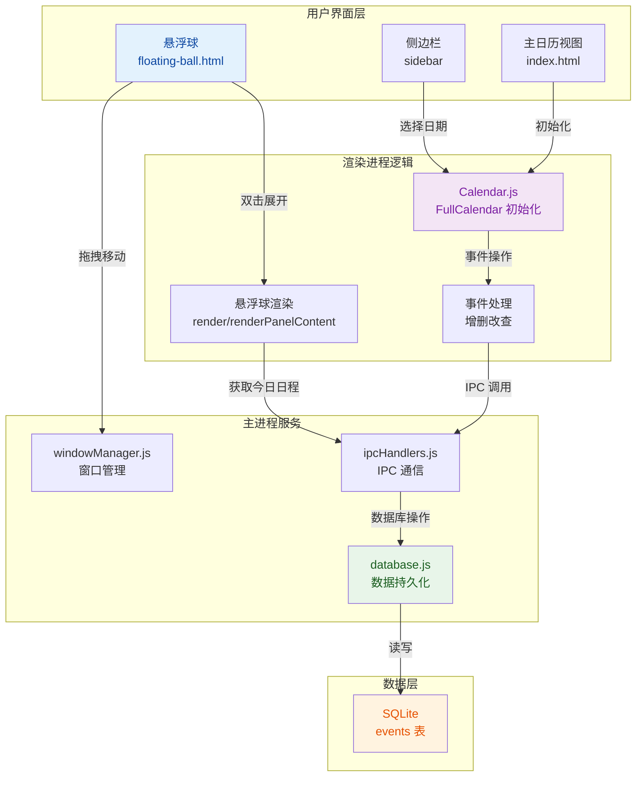
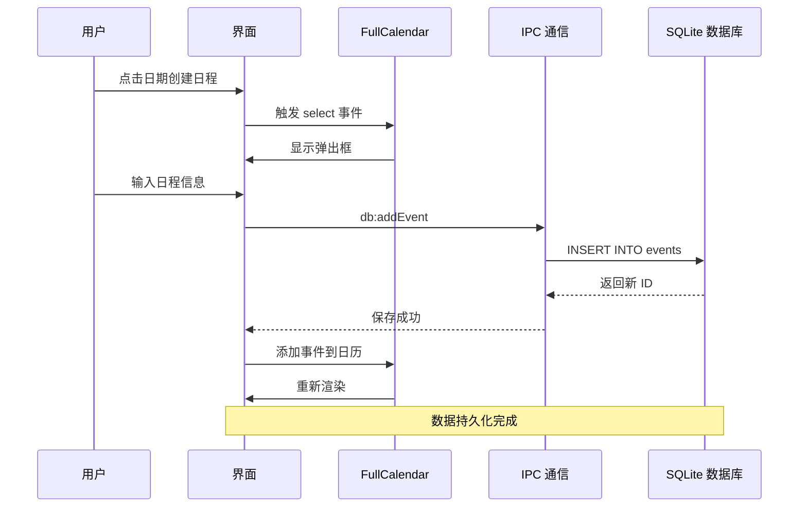
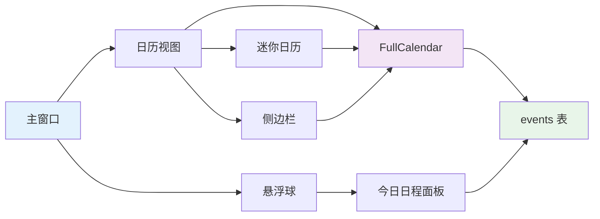

# Skippy - 课程管理助手

一个基于 Electron + Vite 开发的桌面课程管理应用，采用模块化架构设计，支持课程管理、状态跟踪、日历视图、DDL 时间轴、云端同步等多种功能。

## 设计初衷
1. 我想要做一个自己用的日历，不受第三方软件生态闭源的气
2. 这个是我的SEPM课程项目的一个组件，需要先行开发测试

## 📋 快速导航

- 📄 [**项目详细摘要**](摘要.md) - 完整的技术架构、视觉逻辑和核心变更说明
- 📦 功能特点
- 🏗️ 项目结构
- 🚀 快速开始
- 📖 使用指南

## 视觉逻辑与架构

### 系统架构图



### 数据流图



### 核心组件关系



---

### 核心功能

- **课程管理**：添加、删除、编辑课程，支持设置课程名称、时间、日期、频率和重复次数
- **状态管理**：
  - 无标签：默认状态
  - 已上且无问题：绿色
  - 未上/旷课：红色
  - 已上但有问题：黄色
  - 未来课程 DDL：蓝色
- **日历视图**：支持月视图和周视图切换，直观显示课程安排
- **智能悬浮提示**：鼠标悬停课程卡片显示详细信息
- **右侧边栏**：点击课程查看详情和待办事项
- **拖拽调整时间**：周视图中拖拽课程卡片调整时间
- **DDL 时间轴**：左侧滑出面板，显示即将到来的截止日期，带发光动画效果
- **日程快速添加**：右下角悬浮按钮，毛玻璃风格弹窗
- **iCalendar 导出**：导出课程为 .ics 格式，可导入系统日历
- **系统通知**：提前 15 分钟推送上课提醒
- **系统托盘**：最小化到托盘，后台运行，右键菜单快速操作

### 通知增强

- **自定义提醒时间**：5/15/30/60 分钟可选
- **通知历史**：查看历史通知记录
- **通知声音**：可开关提示音

### 邮件提醒

- **SMTP 配置**：支持 Gmail、QQ 邮箱、企业邮箱
- **DDL 邮件提醒**：截止前自动发送邮件提醒
- **课程提醒邮件**：课程开始前发送邮件通知

### 开发中功能

- ⚠️ **云端同步**：Supabase 实时同步功能正在开发中，敬请期待

## 项目结构

```
Skippy/
├── src/
│   ├── main/                      # Electron 主进程代码
│   │   ├── main.js               # 应用入口文件
│   │   ├── preload.js            # 预加载脚本
│   │   └── modules/              # 功能模块目录
│   │       ├── windowManager.js  # 窗口管理模块
│   │       ├── trayManager.js    # 系统托盘模块
│   │       ├── ipcHandlers.js    # IPC 通信处理模块
│   │       ├── database.js       # SQLite 数据库模块
│   │       ├── schema.sql        # 数据库 Schema
│   │       ├── sync.js           # 云端同步模块
│   │       ├── notification.js   # 通知模块
│   │       └── mailer.js        # 邮件发送模块
│   │
│   └── renderer/                 # 前端渲染进程代码
│       ├── index.html           # 主页面
│       ├── css/
│       │   ├── style.css        # 主样式文件
│       │   └── components/      # 组件样式
│       │       ├── calendar.css  # 日历样式
│       │       ├── modal.css    # 弹窗样式
│       │       └── ...
│       └── js/
│           ├── main.js          # 主入口脚本
│           ├── utils/
│           │   ├── storage.js   # 数据存储工具
│           │   └── sync.js     # 同步工具
│           ├── modules/
│           │   └── notification-settings.js  # 通知设置
│           └── core/
│               ├── calendar.js   # 日历核心逻辑
│               ├── course.js    # 课程管理
│               └── ...
│
├── package.json                  # 项目配置
├── vite.config.js                # Vite 配置
├── .gitignore                    # Git 忽略配置
└── README.md                     # 本文档
```

## 快速开始

### 前提条件

确保您的电脑已安装 Node.js 环境（推荐 v20+）：
- [Node.js 官方下载](https://nodejs.org/zh-cn/download/)

### 安装依赖

```bash
cd Skippy
npm install
```

### 运行应用

```bash
# 启动开发模式（同时运行 Vite 和 Electron）
npm run electron:dev

# 直接启动 Electron 应用
npm run electron
```

## 使用指南

### 1. 添加课程

1. 点击右下角悬浮 "+" 按钮或导航栏"添加课程"
2. 填写课程名称、时间、选择日期
3. 可选择设置为"DDL"类型

### 2. 日历视图操作

- **月视图**：显示整月课程，日期格显示课程名称
- **周视图**：显示一周时间线，课程卡片显示在对应时间段
- **切换视图**：点击"月视图"/"周视图"按钮
- **导航**：点击左右按钮切换上月/下周

### 3. 课程交互

- **悬停**：显示课程详细信息悬浮提示
- **点击**：打开右侧边栏显示课程详情和待办
- **拖拽**（周视图）：拖动课程卡片到新时间段调整时间

### 4. DDL时间轴

1. 点击导航栏"DDL时间轴"按钮
2. 左侧滑出时间轴面板
3. 显示所有DDL的倒计时
4. 带发光节点和呼吸动画效果

### 5. 导出课程

点击导航栏"导出课程"下载 .ics 文件，可导入系统日历

### 6. 系统通知

应用会在课程开始前15分钟推送系统通知提醒

### 7. 云端同步配置

1. 点击导航栏 ⚙️ 设置 按钮
2. 在"☁️ 云端同步"部分填写 Supabase 配置：
   - URL: 你的 Supabase 项目 URL
   - Anon Key: 你的 Supabase Anon Key
3. 点击"保存并连接"
4. 首次使用会自动创建匿名账户

### 8. 邮件提醒配置

1. 在设置页面"📧 邮件提醒"部分
2. 填写 SMTP 服务器信息：
   - SMTP 服务器：如 smtp.gmail.com
   - 端口：587
   - 邮箱账号：your@email.com
   - 密码：应用专用密码
3. 填写收件人（多个用逗号分隔）
4. 点击"测试邮件"验证配置

## 打包应用

```bash
# 打包 Windows 版本
npm run build:win

# 打包 macOS 版本
npm run build:mac

# 打包 Linux 版本
npm run build:linux
```

## 技术栈

- **前端**：HTML5 + CSS3 + JavaScript (ES6+)
- **框架**：Electron 40.x
- **构建工具**：Vite 4.x
- **数据库**：sql.js (SQLite)
- **云端同步**：Supabase
- **邮件**：Nodemailer

## 更新日志

### v1.3.0

**feat: 重构为 React+FullCalendar 架构并实现悬浮球功能**

实现日历应用从原生 JavaScript 到 React+FullCalendar 的全面重构，包含以下主要变更：

- 🎨 **架构重构**
  - 新增 React 组件架构，包括 CalendarApp、FloatingBall 等核心组件
  - 从原生 JavaScript 迁移到现代化组件化开发模式

- 📅 **日历系统升级**
  - 集成 FullCalendar 实现专业日历视图和交互
  - 支持月/周/日三种视图切换
  - 实现迷你日历与主日历双向同步
  - 添加事件弹窗创建和编辑功能

- 🗄️ **数据层扩展**
  - 扩展数据库 schema 支持事件管理
  - 新增 events 表和 categories 表
  - 新增 IPC 处理器处理事件 CRUD 操作

- 🎯 **悬浮球功能**
  - 实现可拖拽悬浮球窗口，支持边缘吸附和展开/收起
  - 双击展开显示今日日程面板
  - 支持在悬浮球中编辑和删除事件

- 💅 **UI/UX 优化**
  - 更新 UI 样式和布局，优化用户体验
  - 添加侧边栏宽度调整功能
  - 实现全局缩放控制（50%-200%）
  - 优化顶栏和按钮样式

- ⚠️ **已知问题**
  - 悬浮球点击响应偶发失效
  - 悬浮球拖拽和贴边隐藏功能待完善
  - 详见"已知问题"章节

### v1.2.0

- 新增 SQLite 数据库存储（替代 localStorage）
- 新增云端同步功能（Supabase）
- 新增增强通知系统
- 新增邮件提醒功能
- 新增设置界面

### v1.1.0

- 新增智能悬浮提示
- 新增右侧边栏联动
- 新增拖拽调整时间
- 新增iCalendar导出
- 新增日程快速添加（FAB）
- 新增DDL时间轴
- 新增系统通知提醒
- 优化月/周视图切换

### v1.0.0

- 实现课程管理核心功能
- 实现状态管理和问题记录
- 实现日历视图
- 实现系统托盘功能

## 常见问题

### Q: 云端同步如何配置？

A: 云端同步功能目前正在开发中，暂时无法使用。敬请期待后续版本更新。

### Q: 邮件发送失败怎么办？

A: 确保使用应用专用密码（非邮箱登录密码），Gmail 需要开启"低安全性应用访问"或使用应用专用密码。

### Q: 数据库文件在哪里？

A: 数据库文件位于 `~/Library/Application Support/Skippy/skippy.db`

## 已知问题

### ⚠️ 悬浮窗功能

目前悬浮窗功能存在以下已知问题，我们将在后续版本中修复：

1. **点击无响应**
   - 问题：点击悬浮球有时没有反应，无法展开面板
   - 临时方案：尝试双击悬浮球展开
   - 状态：🔧 修复中

2. **展开后显示异常**
   - 问题：展开后可能不显示小日历和选项界面
   - 临时方案：关闭后重新展开
   - 状态：🔧 修复中

3. **拖拽功能失效**
   - 问题：无法拖拽悬浮球移动位置
   - 临时方案：无
   - 状态：📋 待处理

4. **贴边隐藏不工作**
   - 问题：拖拽到屏幕边缘后不会自动隐藏
   - 临时方案：手动拖拽到边缘
   - 状态：📋 待处理

如果您遇到以上问题，建议暂时使用主界面的日历功能。我们会尽快修复这些问题！

## 许可证

MIT License
