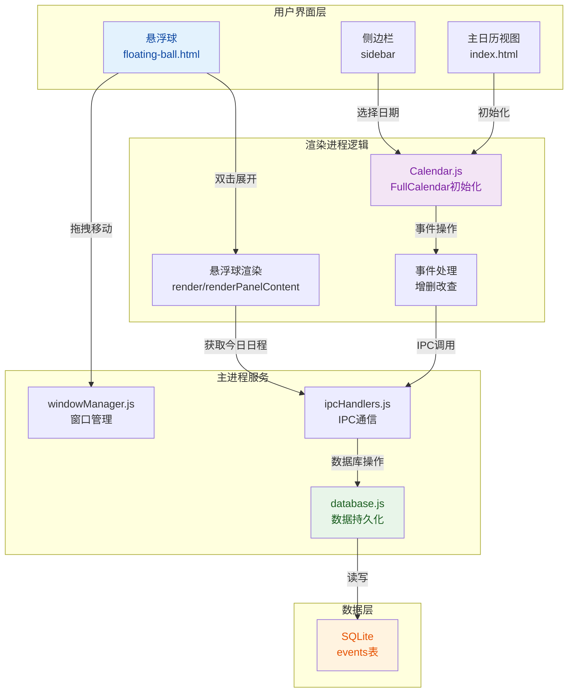
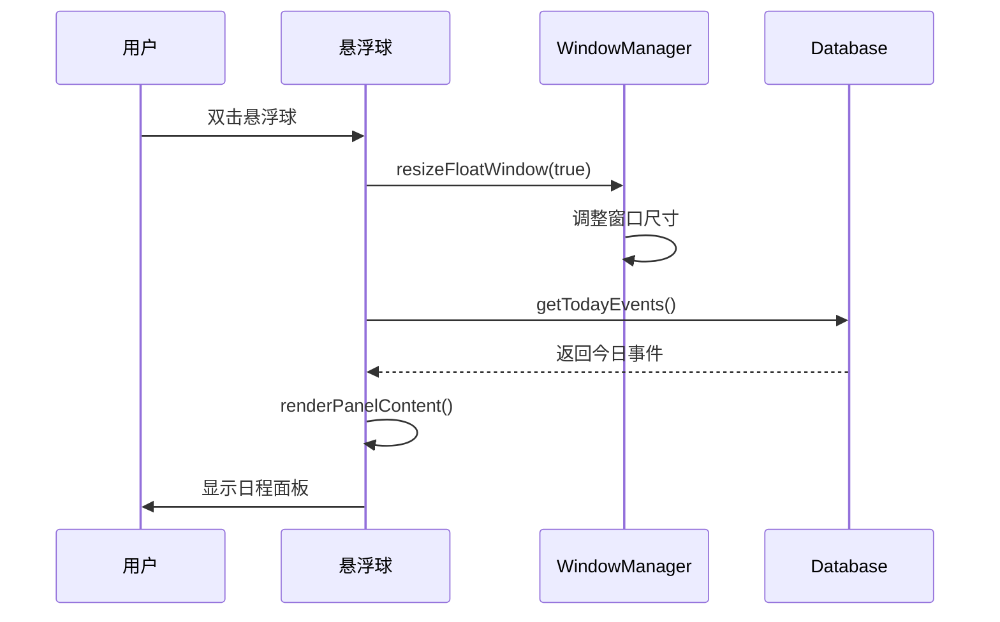

## 1. 高层摘要 (TL;DR)

*   **影响范围:** **高** - 重构了整个日历系统，引入FullCalendar替代自定义实现，并大幅增强了悬浮球功能
*   **核心变更:**
    *   📅 引入 **FullCalendar** 库替代原有的自定义日历渲染
    *   🗄️ 新增 `events` 表及相关数据库操作，支持日程的增删改查
    *   🎯 悬浮球从简单的进度条升级为可展开的日程面板
    *   🎨 全面升级UI设计，采用现代Material Design风格
    *   🔧 添加窗口吸附、动画、缩放等交互增强

---

## 2. 视觉概览 (代码与逻辑映射)



---

## 3. 详细变更分析

### 📦 依赖管理 (package.json)

| 包名 | 类型 | 版本 | 用途 |
|------|------|------|------|
| `@vitejs/plugin-react` | devDependencies | ^5.1.4 | React插件支持 |
| `@fullcalendar/core` | dependencies | ^6.1.20 | FullCalendar核心库 |
| `@fullcalendar/daygrid` | dependencies | ^6.1.20 | 月视图插件 |
| `@fullcalendar/interaction` | dependencies | ^6.1.20 | 交互插件(拖拽、选择) |
| `@fullcalendar/react` | dependencies | ^6.1.20 | React绑定 |
| `@fullcalendar/timegrid` | dependencies | ^6.1.20 | 周/日视图插件 |
| `react` | dependencies | ^19.2.4 | React框架 |
| `react-dom` | dependencies | ^19.2.4 | React DOM |
| `react-calendar` | dependencies | ^6.0.0 | 迷你日历组件 |

---

### 🗄️ 数据库层 (database.js, schema.sql)

**新增表结构:**

```sql
-- Events表 (用于FullCalendar)
CREATE TABLE IF NOT EXISTS events (
    id TEXT PRIMARY KEY,
    title TEXT NOT NULL,
    start_time TEXT NOT NULL,
    end_time TEXT,
    is_all_day INTEGER DEFAULT 0,
    category TEXT DEFAULT 'default',
    rrule TEXT,
    color TEXT DEFAULT '#4285F4',
    createdAt TEXT DEFAULT CURRENT_TIMESTAMP,
    updatedAt TEXT DEFAULT CURRENT_TIMESTAMP
);

-- Categories表
CREATE TABLE IF NOT EXISTS categories (
    id TEXT PRIMARY KEY,
    name TEXT NOT NULL,
    color TEXT DEFAULT '#4285F4',
    createdAt TEXT DEFAULT CURRENT_TIMESTAMP
);
```

**新增数据库函数:**

| 函数名 | 功能 | 返回值 |
|--------|------|--------|
| `getAllEvents()` | 获取所有事件 | `Array<Event>` |
| `getEventById(id)` | 根据ID获取事件 | `Event \| null` |
| `saveEvent(event)` | 保存或更新事件 | `Event` |
| `deleteEvent(id)` | 删除事件 | `void` |
| `getTodayEvents()` | 获取今日事件 | `Array<Event>` |

---

### 🎨 悬浮球重构 (floating-ball.html)

**主要变化:**

| 方面 | 旧实现 | 新实现 |
|------|--------|--------|
| **尺寸** | 85x50px | 60x60px (收起) / 280x350px (展开) |
| **功能** | 显示进度 "0:0" | 显示今日日程、支持编辑 |
| **交互** | 悬停显示子菜单 | 双击展开面板 |
| **样式** | 紫色背景条 | 白色毛玻璃圆形/圆角卡片 |
| **数据源** | IPC推送更新 | 主动从数据库获取 |

**新增状态管理:**
```javascript
let isExpanded = false;      // 是否展开
let todayEvents = [];        // 今日事件列表
let nextEvent = null;        // 下一个事件
let editingEvent = null;     // 正在编辑的事件
```

**核心渲染流程:**


---

### 📅 日历系统重构 (calendar.js)

**FullCalendar配置:**

```javascript
{
  initialView: 'dayGridMonth',  // 默认月视图
  locale: 'zh-cn',              // 中文本地化
  editable: true,               // 可编辑
  selectable: true,             // 可选择日期
  dayMaxEvents: true,           // 事件过多时显示"+更多"
  slotMinTime: '06:00:00',      // 时间轴起始
  slotMaxTime: '23:00:00',      // 时间轴结束
  events: events,               // 事件数据
  // 事件回调
  select: handleDateSelect,      // 日期选择
  eventClick: handleEventClick,  // 事件点击
  eventDrop: handleEventDrop,    // 事件拖拽
  eventResize: handleEventResize  // 事件调整大小
}
```

**新增功能模块:**

| 模块 | 功能描述 |
|------|----------|
| **迷你日历** | 侧边栏显示当前月，支持快速跳转 |
| **事件弹出框** | 选择日期后弹出，快速创建事件 |
| **视图切换** | 月/周/日三种视图 |
| **缩放控制** | 50%-200%缩放 |
| **侧边栏调整** | 可拖拽调整宽度(200-400px) |
| **事件持久化** | 新建/编辑事件保存到数据库 |

---

### 🪟 窗口管理增强 (windowManager.js)

**新增功能:**

| 功能 | 实现方式 |
|------|----------|
| **窗口展开/收起** | IPC handler `resize-float-window` |
| **窗口吸附动画** | `animateWindow()` - 15帧缓动动画 |
| **智能定位** | 根据屏幕边缘自动吸附 |
| **阴影控制** | `hasShadow: false` 消除边框 |

**窗口尺寸配置:**
```javascript
const FLOATING_BALL_CONFIG = {
  width: 60,        // 收起状态
  height: 60,
  // 展开时通过 setBounds 动态调整为 280x350
}
```

---

### 🎨 UI/UX 改进

**配色方案:**

| 元素 | 颜色 | 用途 |
|------|------|------|
| 主色调 | `#1a73e8` | 蓝色 - 主要按钮、链接 |
| 警告色 | `#d93025` | 红色 - 删除、DDL |
| 成功色 | `#137333` | 绿色 - 完成状态 |
| 背景色 | `#f8f9fa` | 浅灰 - 页面背景 |
| 边框色 | `#e0e0e0` | 灰色 - 分隔线 |

**CSS架构改进:**
- 移除了破坏FullCalendar布局的 `table` 覆写
- 使用CSS变量管理主题色
- 添加毛玻璃效果 (`backdrop-filter: blur`)
- 统一圆角规范 (4px/6px/8px/16px)

---

### 🔌 IPC通信扩展 (ipcHandlers.js, preload.js)

**新增IPC通道:**

| 通道名 | 方向 | 功能 |
|--------|------|------|
| `db:getEvents` | Renderer→Main | 获取所有事件 |
| `db:getEventById` | Renderer→Main | 根据ID获取事件 |
| `db:addEvent` | Renderer→Main | 添加新事件 |
| `db:updateEvent` | Renderer→Main | 更新事件 |
| `db:deleteEvent` | Renderer→Main | 删除事件 |
| `db:getTodayEvents` | Renderer→Main | 获取今日事件 |
| `resize-float-window` | Renderer→Main | 调整悬浮球窗口 |

---

## 4. 影响与风险评估

### ⚠️ 破坏性变更

1. **HTML结构变更**
   - `index.html` 中的日历容器从 `.view#calendarView` 变为 `.app-container#calendarApp`
   - 旧的自定义日历元素 (`#prevPeriod`, `#nextPeriod`) 已移除

2. **数据库Schema变更**
   - 新增 `events` 和 `categories` 表
   - 需要运行数据库迁移（通过 `schema.sql` 自动处理）

3. **悬浮球交互变更**
   - 从"悬停显示子菜单"变为"双击展开面板"
   - 旧的 `ballWindowMove` IPC 仍保留，但交互方式改变

### ✅ 测试建议

| 测试场景 | 验证点 |
|----------|--------|
| **日历基础功能** | 月/周/日视图切换、事件显示 |
| **事件创建** | 点击日期创建、保存到数据库 |
| **事件编辑** | 点击事件修改标题、调整时间 |
| **事件拖拽** | 拖拽事件到新日期、时间 |
| **悬浮球展开** | 双击展开、显示今日日程 |
| **悬浮球编辑** | 在悬浮球中修改/删除事件 |
| **窗口吸附** | 拖拽悬浮球、自动吸附边缘 |
| **数据持久化** | 重启应用后事件仍存在 |
| **空状态处理** | 今日无日程时显示提示 |
| **边界情况** | 跨月事件、全天事件 |

---

## 5. 技术亮点

1. **🎯 渐进式增强**: FullCalendar CDN引入，不依赖构建工具
2. **🔄 数据流清晰**: UI → IPC → Database → IPC → UI
3. **🎨 现代化UI**: 毛玻璃、阴影、圆角、动画
4. **📱 响应式设计**: 侧边栏可调整、日历可缩放
5. **🔧 可维护性**: 模块化CSS、统一配色方案

---

## 6. 后续优化建议

1. **性能优化**: 大量事件时考虑虚拟滚动
2. **同步功能**: 添加云端同步支持
3. **提醒功能**: 集成系统通知
4. **导入导出**: 支持iCal格式导入导出
5. **主题定制**: 支持深色模式